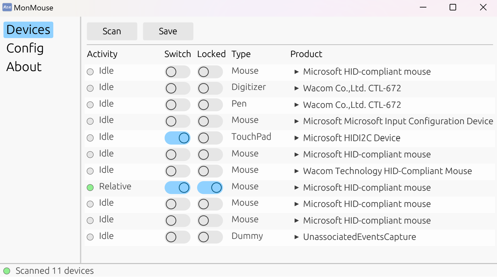

# MonMouse: seamless switching between multiple mouses on multiple monitors

 

The initial motivation behind MonMouse was reducing mouse movement when primarily working on the primary monitor and 
occasionally utilizing a pen tablet on the secondary monitor. The need to repeatedly move the mouse back to the primary monitor when switching to writing is tedious.

Additionally, MonMouse integrates features aimed at enhancing mouse workflow across multiple monitors. 

Glad to hear new ideas, feature requests, and feedback, which you can share on [Github Issues page](https://github.com/melon-masou/MonMouse/issues)!

**NOTE: MonMouse is different from mouse multiplexer designed for multiple users "sharing" one PC with their own mouse. Instead, it remembers the cursor's position when you switch to another mouse, eliminating the need to reposition the cursor each time. Please note that MonMouse is not intended for use with two mouses simultaneously.**

## Features

- Switch: Remembers the cursor position when moving to another mouse, and restores it when switching back.
- Lock: Resitrict the mouse cursor inside one monitor(includes a shortcut to jump between monitors).
- Partial support for various common pointer devices: mouse, touchpad, touchscreen, pen tablet, etc.
- No additional driver installation required.
- Currently only support Windows

## Download
- Download prebuilt from [Releases](https://github.com/melon-masou/MonMouse/releases).
- MSVC-140+ is required. You can get latest from [latest-supported-vc-redist](https://learn.microsoft.com/en-us/cpp/windows/latest-supported-vc-redist)

## License
This project is licensed under the MIT License.

## Screenshot
